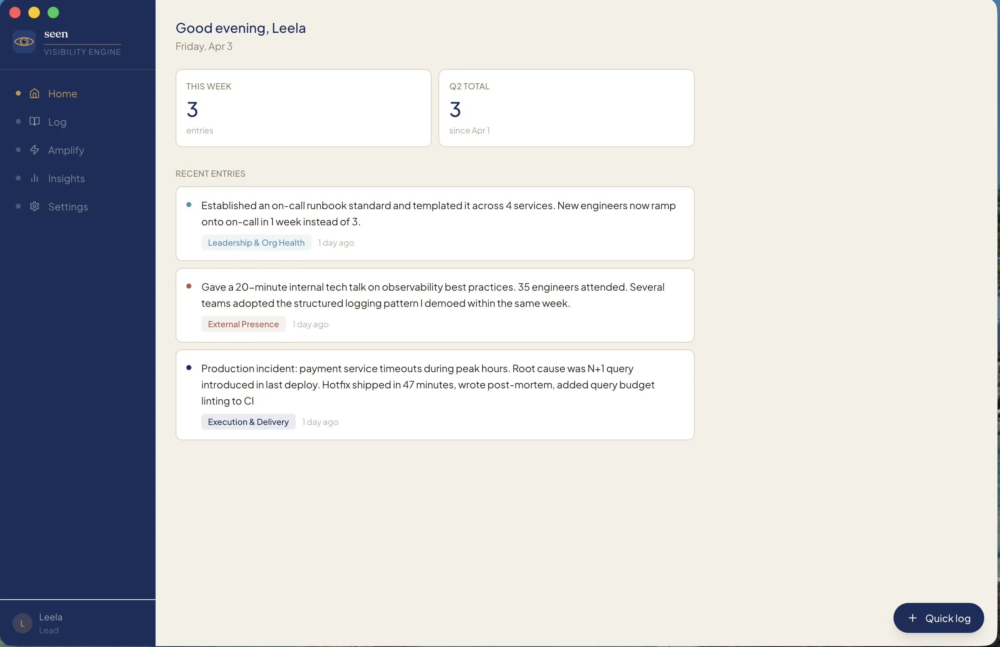

<p align="center">
  
</p>

<h1 align="center">Seen</h1>

<p align="center"><em>Do great work. Make sure it's Seen.</em></p>

---

Most engineers do more than they get credit for. Not because the work isn't there, but because it isn't documented. Seen fixes that. Just write what's on your mind — what you're shipping, learning, and unblocking. Seen classifies it against your promotion criteria and generates the brag documents and quarterly narratives you need when review season hits.

## What it does

**Log work in plain language**
Seen classifies each entry into promotion criteria buckets using a local or cloud AI model.

**Generate monthly brag statements**
Organized by goal area, ready to drop into a promotion packet.

**Generate quarterly review narratives**
In Situation / Task / Outcome format, built for calibration conversations.

**Ask questions about your work log**
*"What are my biggest wins this quarter?"* &nbsp; *"Am I thin on Technical Scope?"*

Your career data never leaves your machine.



## Privacy & data

What you log is confidential by design. Project names, org context, NDA-sensitive work — it all stays on your machine when using the default Ollama provider. If you opt into Anthropic, your entries are sent to Anthropic's API to generate outputs — no other third party receives your data.

## Download

Get the latest installer from the [Releases page](https://github.com/leelakumili/seen/releases).

| Platform | File |
|---|---|
| macOS (Apple Silicon) | `Seen-x.x.x-arm64.dmg` |
| macOS (Intel) | `Seen-x.x.x-x64.dmg` |
| Windows | `Seen-Setup-x.x.x.exe` |
| Linux | `Seen_x.x.x_amd64.deb` |

See [INSTALL.md](INSTALL.md) for platform steps, the macOS Gatekeeper workaround, and AI setup.

## AI provider

Seen defaults to **Ollama**. Switch to Anthropic in **Settings → AI provider** — paste your API key directly in the app, no restart needed.

**Ollama network access:** Ollama must be reachable over the network from the app. By default Ollama only binds to `127.0.0.1`, which works for local development. If you're running a packaged build or Ollama on a different host, start it with network access enabled:

```bash
OLLAMA_HOST=0.0.0.0 ollama serve
```

To use environment variables instead (for example, in CI or scripted setups):

```bash
# .env
AI_PROVIDER=anthropic
ANTHROPIC_API_KEY=sk-ant-...
AI_MODEL=claude-sonnet-4-6
```

## Goal buckets

Seen classifies entries against the six criteria that appear in staff and EM promotion documents:

| Bucket | What goes here |
|---|---|
| Technical Scope & Influence | Architectural decisions, cross-team technical impact |
| People Impact | Mentorship, unblocking, hiring, career development of others |
| Leadership & Org Health | Process improvements, culture, team health, cross-team facilitation |
| Innovation & Bets | Risk-taking, new approaches, forward-looking work |
| External Presence | Talks, writing, community, recruiting signal |
| Execution & Delivery | Shipping, reliability, concrete outcomes |

Buckets are fully customisable in Settings to match your org's specific promotion criteria.

## Development

```bash
# Prerequisites: Node 20+

git clone https://github.com/leelakumili/seen
cd seen
npm install
npm run dev
```

Seen opens as a desktop app. Go to **Settings** to configure your name, role, and AI provider.

```bash
npm test              # run tests in watch mode
npm run test:coverage # coverage report
```

See [docs/technical-doc.md](docs/technical-doc.md) for architecture, data model, and how to extend the app.

## Contributing

MIT licensed. Issues and PRs welcome. See [CONTRIBUTING.md](CONTRIBUTING.md) for guidelines.

## License

MIT © Leela Kumili

---


