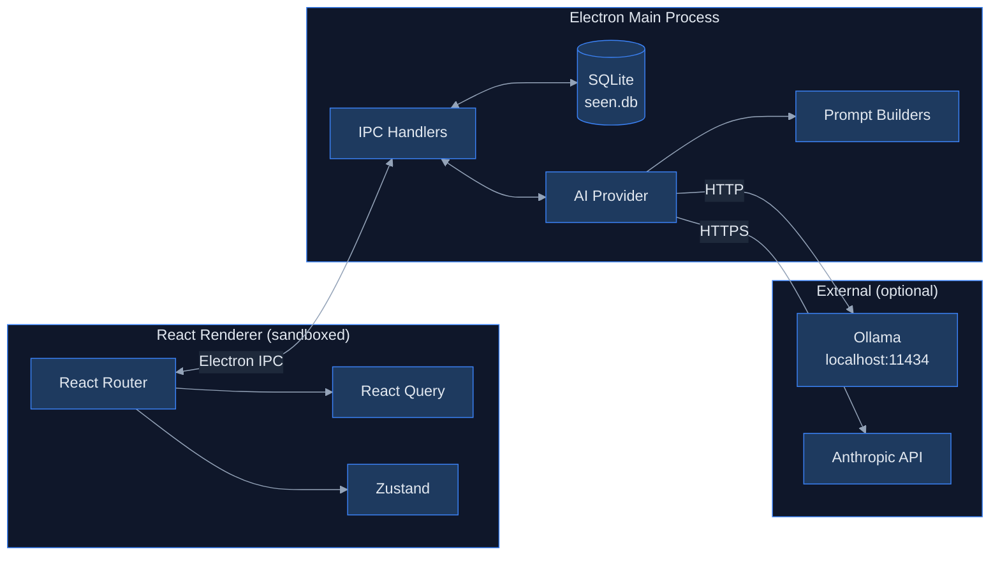
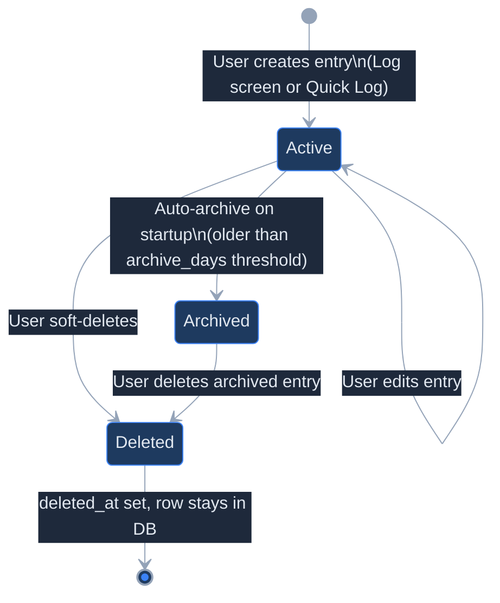
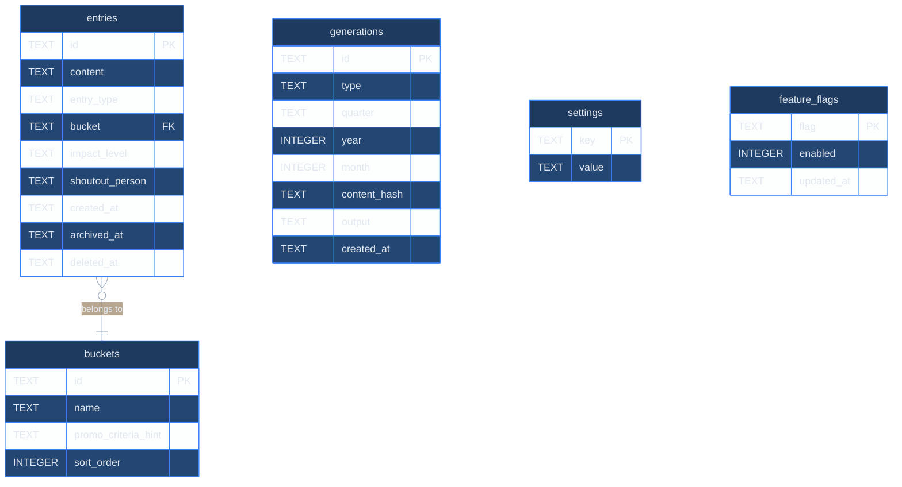
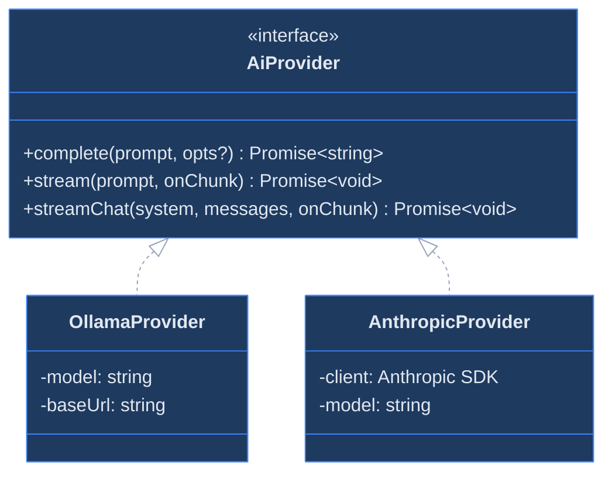

<p align="center">
  
</p>

# Seen: Technical Documentation

This document is for contributors and developers working on the Seen codebase. It covers the architecture, data model, AI system, and how to extend the app.

---

## Table of Contents

1. [Architecture Overview](#1-architecture-overview)
2. [Application Flow](#2-application-flow)
3. [State Management](#3-state-management)
4. [Database](#4-database)
5. [AI Provider System](#5-ai-provider-system)
6. [Development Setup](#6-development-setup)
7. [Extending Seen](#7-extending-seen)
8. [Data Export](#8-data-export)
9. [Glossary](#9-glossary)

---

## 1. Architecture Overview

Seen is an Electron desktop application with a strict security boundary between the React renderer and the Node.js main process. The renderer is sandboxed — it has no direct access to the filesystem, SQLite, or Node.js APIs. Everything crosses the Inter-Process Communication (IPC) bridge via `window.seen.*`, a typed API exposed through Electron's `contextBridge`.



**Technology stack:**

- **Desktop shell**: Electron
- **UI**: React, React Router, Tailwind CSS, Radix UI, Lucide
- **Language**: TypeScript (strict)
- **State**: TanStack React Query (server/IPC state), Zustand (UI state)
- **Database**: SQLite via better-sqlite3
- **AI**: Ollama HTTP API (default), Anthropic SDK (opt-in)
- **Build**: Vite + vite-plugin-electron, electron-builder
- **Testing**: Vitest + @vitest/coverage-v8

**Design principles:**

- **Data on your machine**: All data lives in a SQLite file on the user's machine. No cloud sync, no transmission.
- **IPC-gated data access**: The renderer cannot import `better-sqlite3` or `fs`. Every database operation crosses the IPC bridge via `window.seen.*`.
- **Confidential by design**: AI defaults to Ollama, running on-device. Anthropic is opt-in, configured in the app.
- **Soft deletes only**: Entries are never hard-deleted. `deleted_at` and `archived_at` columns track lifecycle state, keeping data recoverable.

---

## 2. Application Flow

### 2.1 Startup Sequence

1. `initDb()`: opens `seen.db`, enables WAL mode
2. `runMigrations()`: applies any pending `.sql` files in order
3. `runAutoArchive()`: soft-archives entries past the configured threshold
4. IPC handlers registered; notification scheduler initialized
5. `BrowserWindow` created; renderer calls `settings.getAll()` and hydrates Zustand

**Notifications:** On startup, `initNotifications()` schedules a daily reminder to log work. The schedule is set using `setTimeout` (rescheduled after each fire) and fires a native OS notification via Electron's `Notification` API. The reminder time is configurable via Settings.

### 2.2 IPC Communication Flow

The renderer is sandboxed and has no access to Node.js directly. All data crosses the preload bridge via `window.seen.*`. For example, calling `window.seen.entries.create(payload)` from a component invokes `ipcRenderer.invoke('entries:create')`, which the main process handles via `validateEntry()` → `db.prepare(INSERT).run()`, returning the saved object.

### 2.3 AI Generation Flow

**Before streaming:** The IPC handler fetches the relevant entries, user context (name, role, target role), and bucket names. It builds a prompt using the relevant prompt module and sends it to the active AI provider.

**During and after streaming:** Token chunks stream back to the renderer via `webContents.send('ai:stream-chunk')` and are appended to a local buffer in the component. When the model finishes, the full output is saved to the `generations` table. A `content_hash` of the prompt inputs is stored alongside the output — if entries change after a generation was saved, Seen detects the mismatch and prompts the user to regenerate.

### 2.4 Entry Lifecycle



---

## 3. State Management

React Query owns database state. Zustand owns UI state. They don't overlap by design.

- **React Query**: anything that reads from or writes to the database via IPC. Mutations call `qc.invalidateQueries` to keep all views consistent after a write.
- **Zustand**: settings hydrated at startup from `settings.getAll()`, and the `quickLogOpen` boolean for the quick-log modal.
- **Component state**: streaming output (`streamBuffer`, `liveReply`) stays in `useState` inside `Amplify.tsx`. It does not need to persist across navigation.

---

## 4. Database

### 4.1 Connection and Location

The database is a singleton managed in the main process.

```typescript
// db/client.ts (simplified)
const db = new Database(path.join(app.getPath('userData'), 'seen.db'))
db.pragma('journal_mode = WAL')
db.pragma('foreign_keys = ON')
runMigrations(db)
```

| Platform | Database path |
|---|---|
| macOS | `~/Library/Application Support/seen/seen.db` |
| Linux | `~/.config/seen/seen.db` |
| Windows | `%APPDATA%\seen\seen.db` |

### 4.2 Schema



**Entry types:** `win` · `blocker` · `shoutout` · `learning` · `delivery`

**Impact levels:** `team` · `org` · `cross-org`

**Generation types:** `brag_doc` · `quarterly` · `brag_month`

**`content_hash`:** Stored with each generation. It is a hash of the prompt inputs — entries, user context, and date range — for that generation run. When the user opens the Amplify screen, Seen recomputes the hash and compares it to the stored value. If the inputs have changed since the last run, the UI surfaces a prompt to regenerate.

**`feature_flags`:** A lightweight kill-switch table for in-development features. Currently used to gate the Insights screen (analytics, v2). Flags can be toggled via direct SQL during development — see the [Direct database access](#direct-database-access) section.

**Default buckets:**

| ID | Name | Promo criteria hint |
|---|---|---|
| `technical-scope` | Technical Scope & Influence | Breadth, architectural decisions, cross-team technical impact |
| `people-impact` | People Impact | Mentorship, unblocking, career development of others, hiring panel participation |
| `leadership-org` | Leadership & Org Health | Process improvements, culture, team health, hiring, cross-team facilitation |
| `innovation-bets` | Innovation & Bets | Risk-taking, new approaches, forward-looking work |
| `external-presence` | External Presence | Talks, writing, community, recruiting signal |
| `execution` | Execution & Delivery | Shipping, reliability, concrete outcomes |

### 4.3 Migrations

As Seen evolves, the database schema changes: new columns get added, tables get restructured. Migrations handle this safely so existing user data is never lost when the app updates.

Each migration is a plain `.sql` file in `db/migrations/`. On startup, Seen checks which files have already run (tracked in `_migrations`) and applies any new ones in alphabetical order. A user on an older version gets all missed migrations applied in sequence when they update.

To add a new migration: create `db/migrations/004_your_change.sql`. It runs automatically on next startup.

### 4.4 Soft Delete Pattern

Seen never issues `DELETE` against user data. Lifecycle state is tracked with timestamp columns.

```sql
-- Soft delete (user action)
UPDATE entries SET deleted_at = datetime('now') WHERE id = ?;

-- Auto-archive (on startup, age-based)
UPDATE entries SET archived_at = datetime('now')
WHERE deleted_at IS NULL
  AND archived_at IS NULL
  AND created_at <= datetime('now', '-90 days');

-- Standard read query (excludes both)
SELECT * FROM entries
WHERE deleted_at IS NULL
  AND archived_at IS NULL
ORDER BY created_at DESC;
```

---

## 5. AI Provider System

`ai/provider.ts` exposes a single `AiProvider` interface, implemented by both backends.



**Provider selection**: resolved at runtime from the `settings` table, with environment variables as fallback:

```
settings.ai_provider = 'ollama'     → OllamaProvider  (default)
settings.ai_provider = 'anthropic'  → AnthropicProvider
```

The Anthropic API key is read from `settings.anthropic_api_key` first, then the `ANTHROPIC_API_KEY` env var. The key can be rotated in Settings without restarting the app.

**Prompt modules:**

| Module | Streaming | Max tokens | Description |
|---|---|---|---|
| `suggest.ts` | No | 80 | Few-shot bucket classifier |
| `correct.ts` | No | 500 | Spell / grammar correction |
| `brag-doc.ts` | Yes | 2048 | Monthly brag statements + quarterly brag doc |
| `quarterly.ts` | Yes | 2048 | Quarterly self-assessment (S/T/O format) |
| `ask.ts` | Yes | 2048 | Chat with full entry log context (normal + brag mode) |

All generation prompts include explicit **grounding rules** that prohibit the model from inventing metrics, team names, or outcomes not present in the user's entries.

---

## 6. Development Setup

### 6.1 Prerequisites

| Tool | Version | Notes |
|---|---|---|
| Node.js | 20.x LTS | Required |
| npm | 10.x | Bundled with Node 20 |
| Ollama | latest | Optional: only needed if using Ollama as AI provider |

### 6.2 Installation

```bash
git clone https://github.com/leelakumili/seen.git
cd seen
npm install
```

`better-sqlite3` is a native Node.js addon compiled during `npm install`. Platform requirements:

- **macOS**: run `xcode-select --install` before `npm install`
- **Linux**: ensure `build-essential` is installed (`sudo apt install build-essential`)
- **Windows**: install Visual Studio Build Tools with the "Desktop development with C++" workload

> If `npm install` fails with a `node-gyp` error, one of the above is almost certainly the cause.

### 6.3 Environment Configuration

```bash
cp .env.example .env
```

| Variable | Default | Description |
|---|---|---|
| `AI_PROVIDER` | `ollama` | `ollama` or `anthropic` |
| `OLLAMA_HOST` | `http://localhost:11434` | Ollama server URL |
| `AI_MODEL` | `llama3` | Model name for the active provider |
| `ANTHROPIC_API_KEY` | - | Fallback if not set in Settings |
| `ELECTRON_OPEN_DEVTOOLS` | - | Set to `true` to auto-open DevTools |

The Settings UI is the primary way to configure the AI provider at runtime. Environment variables are a fallback, useful for scripted or CI environments.

### 6.4 Running in Development

```bash
npm run dev
```

Starts Vite (React HMR on `localhost:5173`) and Electron in parallel. Changes to `src/` hot-reload instantly. Changes to `electron/` require restarting the command.

### 6.5 Building for Production

```bash
npm run build
```

Runs `tsc` (type check) → `vite build` (React → `dist/`) → `electron-builder` (packages to `release/` as `.dmg`, `.exe`, `.deb`).

### 6.6 Running Tests

```bash
npm test               # Vitest in watch mode
npm run test:coverage  # Single run with coverage report
```

Coverage thresholds (enforced): 90% lines, 90% functions, 90% statements, 80% branches.

---

## 7. Extending Seen

### 7.1 Adding a new IPC handler

IPC handlers live in `electron/ipc/`. Each file registers handlers using `ipcMain.handle` and exports a registration function called from `electron/main.ts`.

**1. Create `electron/ipc/your-feature.ts`:**

```typescript
import { ipcMain } from 'electron'
import { getDb } from '../../db/client'

export function registerYourFeatureHandlers() {
  const db = getDb()
  ipcMain.handle('your-feature:list', () => {
    return db.prepare('SELECT * FROM your_table').all()
  })
}
```

**2. Register in `electron/main.ts`:**

```typescript
import { registerYourFeatureHandlers } from './ipc/your-feature'
// ...
registerYourFeatureHandlers()
```

**3. Expose in `electron/preload.ts`:**

```typescript
yourFeature: {
  list: () => ipcRenderer.invoke('your-feature:list'),
}
```

**4. Add TypeScript types** to `src/types/index.ts` under the `SeenBridge` interface.

The renderer can then call `window.seen.yourFeature.list()` from any component.

### 7.2 Adding a new prompt module

Prompt modules live in `ai/prompts/`. Each module exports a function that takes context (entries, user profile, date range) and returns a prompt string.

**1. Create `ai/prompts/your-prompt.ts`:**

```typescript
import type { Entry, UserContext } from '../../src/types'

export function buildYourPrompt(entries: Entry[], ctx: UserContext): string {
  return `You are helping ${ctx.name} (${ctx.role}).

Entries:
${entries.map(e => `- ${e.content}`).join('\n')}

Task: ...

Important: Only reference names, metrics, and outcomes that appear in the entries above. Do not invent or infer details.`
}
```

**2. Add a handler in `electron/ipc/ai.ts`** that calls your prompt builder and streams the result via the active provider. Follow the pattern used by `generateBragMonth`.

**3. Expose via IPC and preload** using the same steps as section 7.1.

> All generation prompts must include a grounding rule prohibiting the model from inventing names, metrics, or outcomes not present in the user's entries. See `brag-doc.ts` for the reference implementation.

---

## 8. Data Export

**Settings → Data** provides two export options:

- **Export JSON**: all active entries as a JSON array, saved to the default Downloads folder
- **Export Markdown**: entries grouped by bucket, formatted for reading or pasting

Generated documents (brag docs, quarterly reviews) can be exported as `.txt` files via the **Copy** or **Export** buttons in the Amplify screen.

### Direct database access

For debugging and advanced use, the database can be queried directly with the `sqlite3` CLI.

```bash
# macOS
sqlite3 ~/Library/Application\ Support/seen/seen.db

# Linux
sqlite3 ~/.config/seen/seen.db

# Windows (PowerShell)
sqlite3 "$env:APPDATA\seen\seen.db"
```

```sql
-- Entry counts by bucket
SELECT bucket, COUNT(*) as c FROM entries
WHERE deleted_at IS NULL GROUP BY bucket ORDER BY c DESC;

-- View archived entries
SELECT id, content, archived_at FROM entries
WHERE archived_at IS NOT NULL AND deleted_at IS NULL;

-- Restore an archived entry
UPDATE entries SET archived_at = NULL WHERE id = '<id>';

-- List all generated documents
SELECT type, quarter, year, month, created_at FROM generations ORDER BY created_at DESC;

-- Check applied migrations
SELECT name, run_at FROM _migrations ORDER BY run_at;

-- Toggle a feature flag (e.g. enable Insights screen)
UPDATE feature_flags SET enabled = 1 WHERE flag = 'insights';
```

> Always back up `seen.db` before running manual write queries.

---

## 9. Glossary

| Term | Definition |
|---|---|
| **Entry** | A single work log item. Has a type (win, blocker, etc.), a bucket, an impact level, and optional fields like `shoutout_person`. |
| **Bucket** | A promotion criteria category (e.g. Technical Scope, People Impact). Entries are classified into buckets by the AI. Customisable in Settings. |
| **Generation** | An AI-produced document: a monthly brag statement, quarterly brag doc, or quarterly review. Saved to the `generations` table with a content hash. |
| **Brag doc** | A formatted document listing wins and contributions, organised by goal area. Intended to drop into a promotion packet. |
| **Quarterly review** | A self-assessment structured in Situation / Task / Outcome format, for use in calibration conversations. |
| **Entry type** | What kind of work the entry represents: `win`, `blocker`, `shoutout`, `learning`, or `delivery`. |
| **Impact level** | The scope of the work's impact: `team`, `org`, or `cross-org`. |
| **Auto-archive** | On startup, entries older than the archive threshold (default: 90 days) are soft-archived and excluded from queries and AI generation context. Configurable via Settings. |
| **Grounding rules** | Prompt-level instructions that prevent the AI from inventing names, metrics, or outcomes not present in the user's entries. |
| **content_hash** | A hash of prompt inputs stored with each generation. Used to detect whether entries have changed since the last generation run. |
| **Feature flag** | A kill-switch row in the `feature_flags` table. Used to gate in-development features — currently the Insights screen (analytics, v2). |
